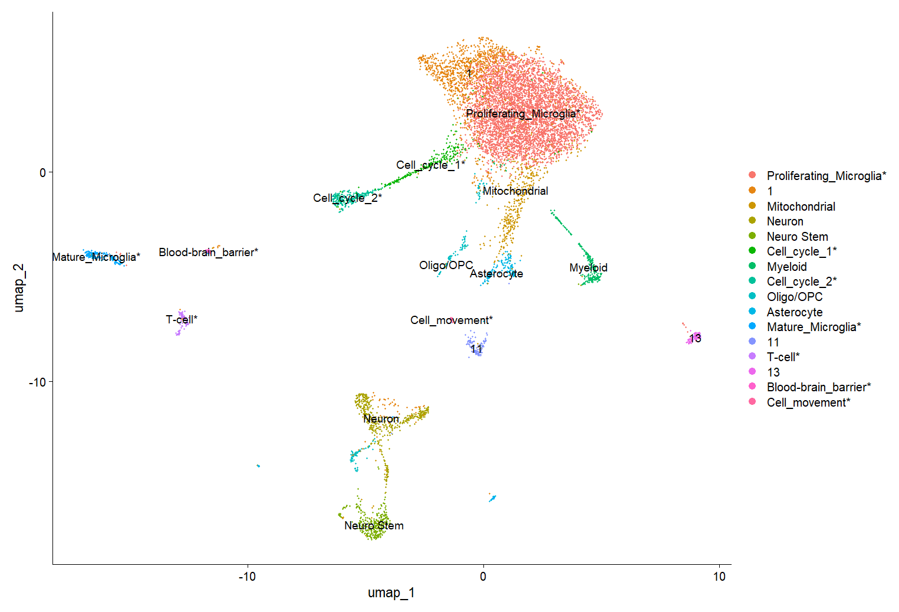
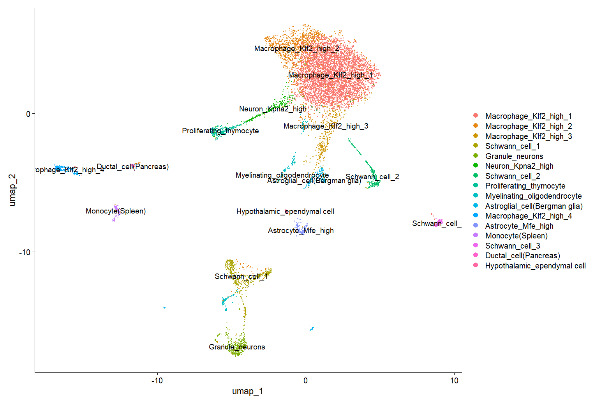
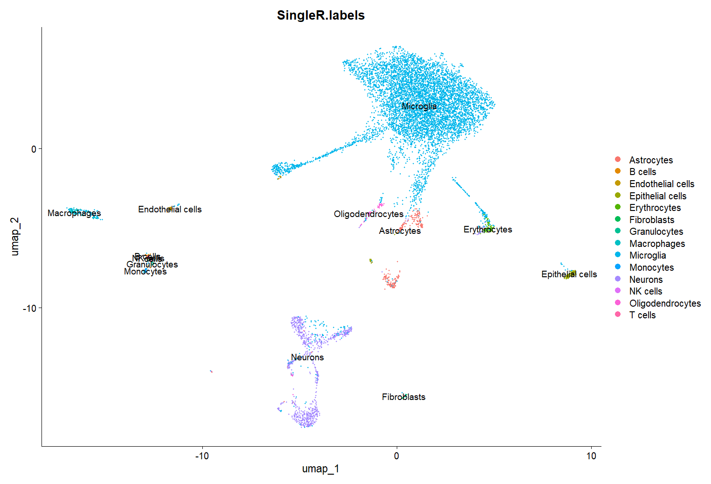

# BCB330Y1 individual project

-   This repo is for individual scRNA-seq project as part of my BCB330Y1 course
-   Raw data excluded

# Progress

1.  First generate annotated umap with most cluster identified (2025/5/21).\
    Control:\
    \
    Treatment:\
    

2.  Generate integrated umap, cell identity not yet annotated (2025/6/3).\
    Integrated:\
    \
    And [research proposal](BCB330_Proposal_Jiaqi_Ma.pdf) written last week

3.  Utilize [Clustree](https://github.com/lazappi/clustree) package to find optimal resolution for clustering.\
    And refactored with GO analysis into another helper_function.R to maintain clean workspace.\
    And move all .R file from root to ~/src file (2025/6/6).

4.  Complete annotation by three tools (2025/6/12).\
    My brain:\
    \
    [Clustifyr](https://github.com/rnabioco/clustifyr):\
    \
    [SingleR](https://github.com/dviraran/SingleR): (SingleR generate different cluster because it's annotated at single-cell level)\
    
