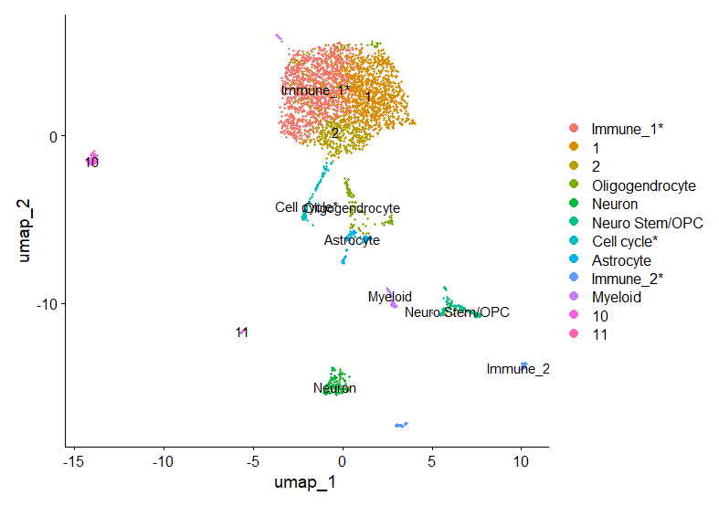
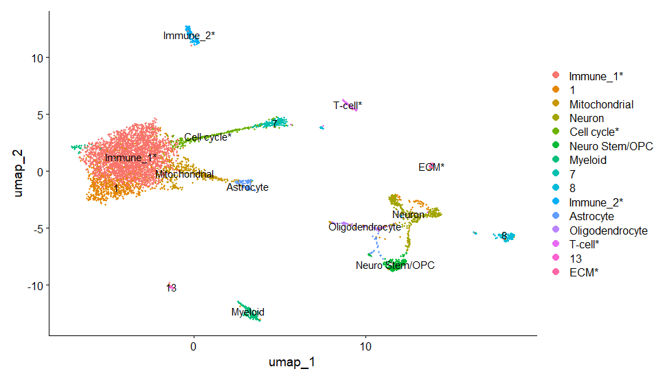

# BCB330Y1 individual project

-   This repo is for individual scRNA-seq project as part of my BCB330Y1 course
-   Raw data excluded

# Progress

1.  First generate annotated umap with most cluster identified (2025/5/21).\
    Control:\
    \
    Treatment:\
    

2.  Generate integrated umap, cell identity not yet annotated (2025/6/3).\
    Integrated:\
    \
    And [research proposal](BCB330_Proposal_Jiaqi_Ma.pdf) written last week
