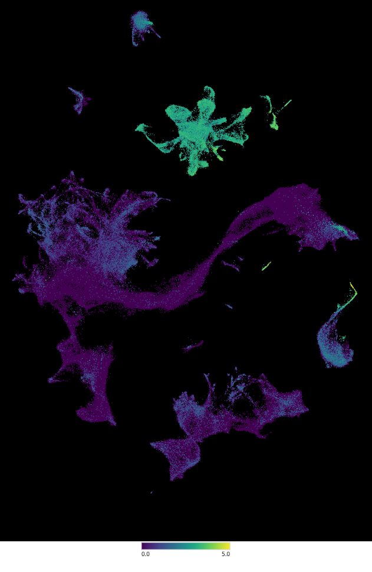

# BCB330Y1 individual project

-   This repo is for individual scRNA-seq project as part of my BCB330Y1 course
-   Raw data excluded

# Progress

1.  First generate annotated umap with most cluster identified (2025/5/21).\
    Control:\
    \
    Treatment:\
    

2.  Generate integrated umap, cell identity not yet annotated (2025/6/3).\
    Integrated:\
    \
    And [research proposal](BCB330_Proposal_Jiaqi_Ma.pdf) written last week

3.  Utilize [Clustree](https://github.com/lazappi/clustree) package to find optimal resolution for clustering.\
    And refactored with GO analysis into another helper_function.R to maintain clean workspace.\
    And move all .R file from root to ~/src file (2025/6/6).

4.  Complete annotation by three tools (2025/6/12).\
    My brain:\
    \
    [Clustifyr](https://github.com/rnabioco/clustifyr):\
    \
    [SingleR](https://github.com/dviraran/SingleR): (SingleR generate different cluster because it's annotated at single-cell level)\
    

5. Complete DEGs analysis between control & treatment of Yuzwa's lab WMI dataset (2025/6/25).\
   Manually determined "Top" DEGs:\
   \
   Influenced by the recent doubt about p-value == 0.05 initiated from this [Paper](https://doi.org/10.1080/00031305.2016.1154108). I calculate another `p_FC` value, which is a function of p_val and avg_log2FC to help me determine the "Significance" of DEGs rather than thresholding p == 0.05.
   ### `p_FC = f(p_val, avg_log2FC) = (1 - p_val) * (avg_log2FC)`
   
6. Complete [Wakui et al](https://doi.org/10.1016/j.bbrep.2025.102026)'s dataset analysis (2025/7/21).
   
   - Umap & annotation:\
    Manual:\
    \
    [Clustifyr](https://github.com/rnabioco/clustifyr):\
    \
    [SingleR](https://github.com/dviraran/SingleR): (SingleR generate different cluster because it's annotated at single-cell level)\
    

   - Cluster proportion:\
    
    
   - Identified Top 5 DEGs:\
    Threashold pct.1 > 0.1 & pct.2 > 0.1 & p_val < 0.05 & (avg_log2FC > 0.25 | avg_log2FC < -0.25), then rank by decreasing (Upregulate)/increasing (Downregulate) p_FC value.\
    Upregulate:\
    \
    Downregulate:\
    

   - Check microglia DEGs identified from Yuzwa lab dataset:\
    Cp(Up), Msh5(Down).\
    Sham/HIE:\
    \
    Sham/Hypoxia:\
    

   - Microglia GO enrichment:\
    Amoung all cluster's DEGs GO, only microglia GO difference is noticable.\
    A transaction from physiological to pathobiological response is observed from Hypoxia to HIE treatment.\
    Hypoxia:\
    \
    HIE:\
    

   - Conclusion of Wakui_et_al dataset:
    1. This dataset has relatively poor quality (~10% cell pass QC)
    2. Neuron & oligodendrocyte lineage heterogeneity observed (Annotation)
    3. Oligodendrocyte lineage developmental arrestment from literature not observed (GO)
    4. Strong Microglia DEGs identified from Yuzwa lab dataset not observed (expression level)
    5. Cluster proportion difference is less significant than expected (Cluster proportion)
    6. Microglia transaction from physiological to pathobiological response is observed from Hypoxia to HIE treatment (GO)

7. Test the reciprocal mapping of DEGs identified in major population of Yuzwa & Wang_et_al's dataset.\
   And common DEGs identified in major population of Yuzwa & Waikui_et_al dataset (2025/7/28).
   - Example of Reciprocal mapping
     - Yuzwa -> Wang_et_al\
       Microglia (KLF4):\
       \
       Neuron (TENM2):\
       \
       Oligo/OPC (MBP):\
       \
       Astro (SLC1A3):\
       
     - Wang_et_al -> Yuzwa\
       Microglia:\
       \
       Astro:\
       \
       Oligo:\
       \
       OPC:\
       \
       EN:\
       \
       IN:\
       \
       RG:\
       \
       Tri_IPC:\
       \
       Vascular:\
       
   - Common UP/Down regulated gene in Yuzwa & Wakui_et_al dataset
     - UP:\
       
     - Down:\
       
   - Conclusion for cross comparison between three dataset:
    1. Yuzwa's dataset's major population is well mapped to Wang_et_al dataset except microglia population.
    2. Yuzwa's dataset Microglia cluster #5 and #7 mapped to RG population in Wang_et_al dataset.
    3. Yuzwa's dataset's small population failed to map to Wang_et_al dataset (ubiquitously/absence).
    4. Wang_et_al's vascular, Tri_IPC, and RG is likely to be absent in Yuzwa's dataset.
    5. There are more common Down regulated gene than Upregulated gene between Yuzwa and Wakui_et_al dataset.
   
   
   
